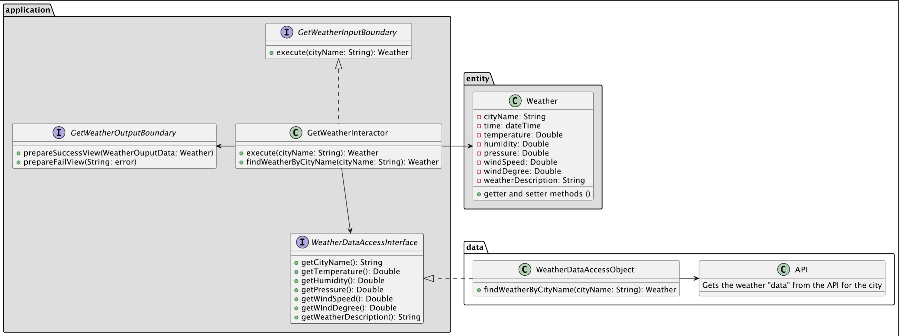

# WeatherWeavers

## Plan
### Start with GetWeatherUseCase
Create a use case that will get the weather from the api and return it to the presenter.

Application Business Rules: Michael - michaelcantprogram \
Interface Adapters: Manskim - junwei0102 \
Entity: William - hondapowerdd \
Other: Edison - linx5o

First we will start with creating the interfaces together. Then we will split up the work and work on our own parts.

Each person will have their own fork to work on their part of the project. 